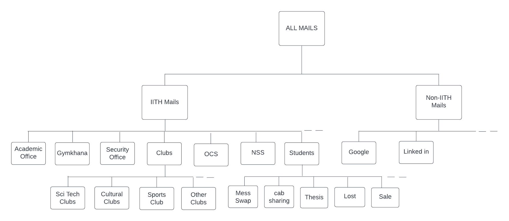

# **Email Filter**

## **Problem**
1. Unhabitual of reading mails regularly 
2. Filtering the Important mails
3. Trapped into Phishing Mails
4. Management of chunk of mails to read again
5. Loosing Information on accidently deleting mails

## **Solution**
It involve two stages of implementation:
### **Stage 1: Categorizing mails**
This stage involves categorizing mails on the basis of domain and and their subject (purpose)

Example:

As shown, every mail recieved will go under their respective category. 

This helps organizing the mails of a student and easy searching relevant mails. Since It also filter on the basis of subject, we can directly go the the particular category as per our need (for example cab sharing etc.).  

Advantage over autocomplete searching (used in gmails), we can avoid phising mails as it will go under non-IITH category. (Like recent phising mails produced by kludge for survey)

### **Stage 2: Personal Assitant over Personal Information**

> Why to search mails to get info ?

> Why to read mails to find something important ?

> Why don't we have personal ChatGPT who answer our personal queries like
1. What is deadline of recent NSS event
2. What is the End data to submit the google form of Epoch Core Selection ?
3. When is Special dinner? Do it have "paneer" ?
4. Do anyone found my Keychain ?
5. Anyone selling router ?
6. And Many more

These all queries can be answered if we can build our own GPT based on our mails. Our Personal assistance will keep on upating with new mails. But It won't loose information with deletion of pervious mails. This way we always hold information even if we loose our mails

Easy searching and Avoid reading mails for small things.
